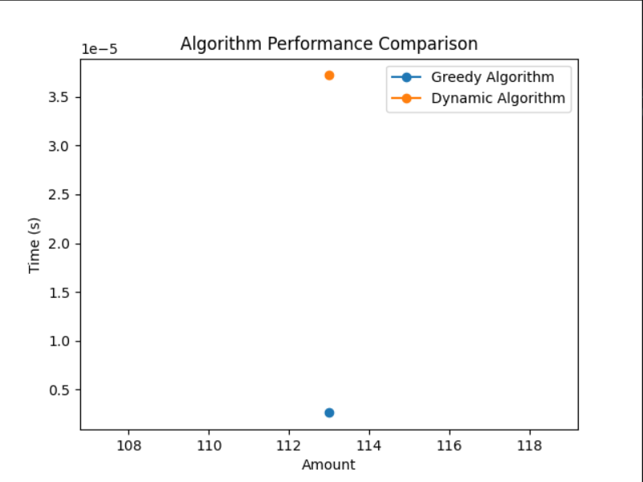
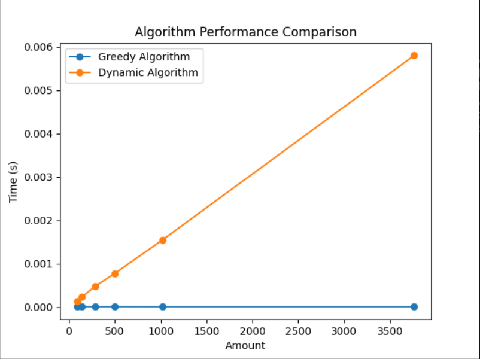

Amount: 113, Greedy Result: {50: 2, 10: 1, 2: 1, 1: 1}, Dynamic Result: {50: 2, 10: 1, 2: 1, 1: 1}
| Amount | Greedy Algorithm Time (s) | Dynamic Algorithm Time (s) |
|---------:|----------------------------:|-----------------------------:|
| 113 | 2.69413e-05 | 0.000575304 |

Amount: 87, Greedy Result: {50: 1, 25: 1, 10: 1, 2: 1}, Dynamic Result: {50: 1, 25: 1, 10: 1, 2: 1}

Amount: 143, Greedy Result: {50: 2, 25: 1, 10: 1, 5: 1, 2: 1, 1: 1}, Dynamic Result: {50: 2, 25: 1, 10: 1, 5: 1, 2: 1, 1: 1}

Amount: 289, Greedy Result: {50: 5, 25: 1, 10: 1, 2: 2}, Dynamic Result: {50: 5, 25: 1, 10: 1, 2: 2}

Amount: 498, Greedy Result: {50: 9, 25: 1, 10: 2, 2: 1, 1: 1}, Dynamic Result: {50: 9, 25: 1, 10: 2, 2: 1, 1: 1}

Amount: 1023, Greedy Result: {50: 20, 10: 2, 2: 1, 1: 1}, Dynamic Result: {50: 20, 10: 2, 2: 1, 1: 1}

Amount: 3764, Greedy Result: {50: 75, 10: 1, 2: 2}, Dynamic Result: {50: 75, 10: 1, 2: 2}
| Amount | Greedy Algorithm Time (s) | Dynamic Algorithm Time (s) |
|---------:|----------------------------:|-----------------------------:|
| 87 | 1.64509e-05 | 0.000176191 |
| 143 | 1.00136e-05 | 0.000284672 |
| 289 | 5.48363e-06 | 0.000552416 |
| 498 | 6.91414e-06 | 0.00107193 |
| 1023 | 8.10623e-06 | 0.00235796 |
| 3764 | 8.10623e-06 | 0.00992537 |

As can be seen, the execution time of the greedy algorithm is significantly lower compared to the dynamic programming algorithm, especially when the sum is increased. This shows that the greedy algorithm is more efficient in execution time, especially for large sums.

A graph illustrating the execution time of both algorithms is also provided. The graph clearly shows that as the amount increases, the execution time of the dynamic programming algorithm increases significantly, while the execution time of the greedy algorithm remains almost unchanged.
